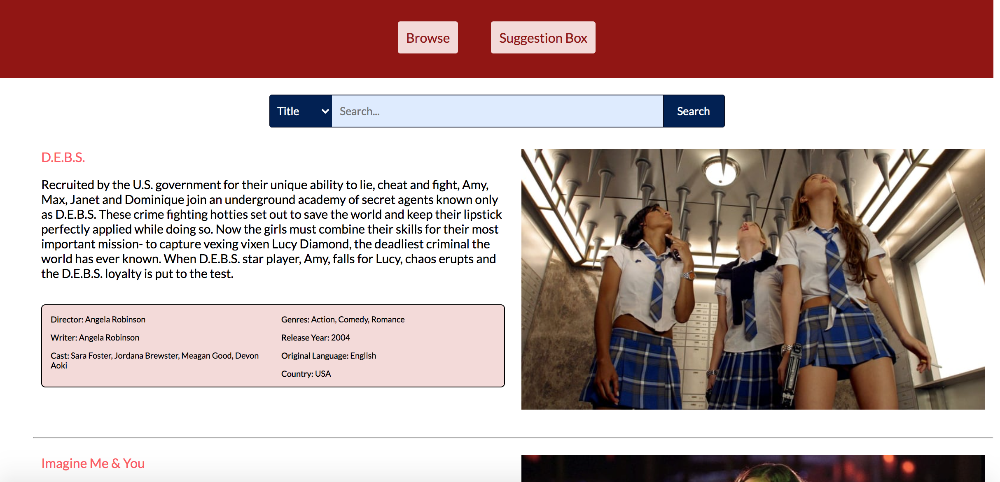
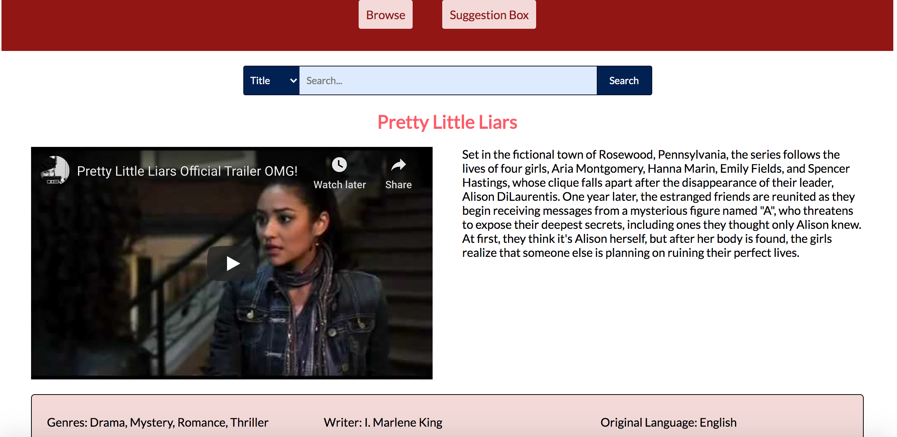
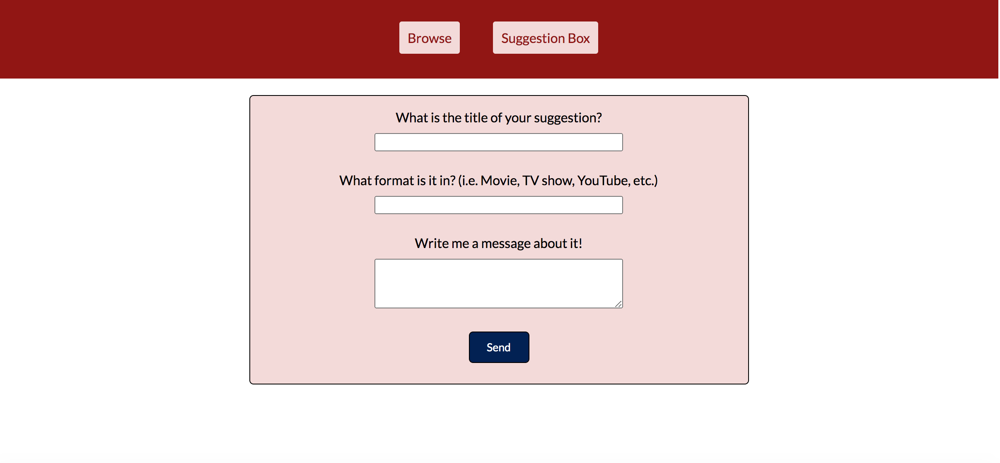

# Unbury Your Gays

Live app: https://lguida.github.io/unbury-your-gays/

## Summary

This app is a mini-database of queer (particularly female-identifying) movies and tv shows. The intent of the app is to allow users to browse titles they may not have heard of, and to search for movies and tv shows by their genre, language, actors involved, and others. Each title can be investigated further and the official trailer is provided within the app. Additionally, there is a suggestion box so that users can suggest their favorite movies and show if they don't find them in the current database.

## Screenshots

Search/Browse page: 

Individual Title/Trailer page: 

Suggestion Box page: 

## Technologies Used

* HTML
* CSS
* JavaScript
* jQuery
* Asynchronous fetch requests

## Author

Lucy Guida: https://github.com/lguida/Portfolio